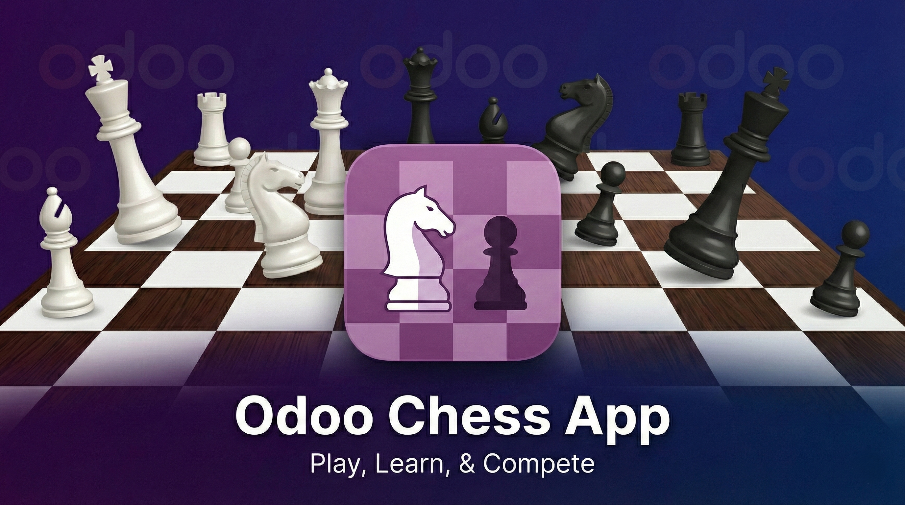
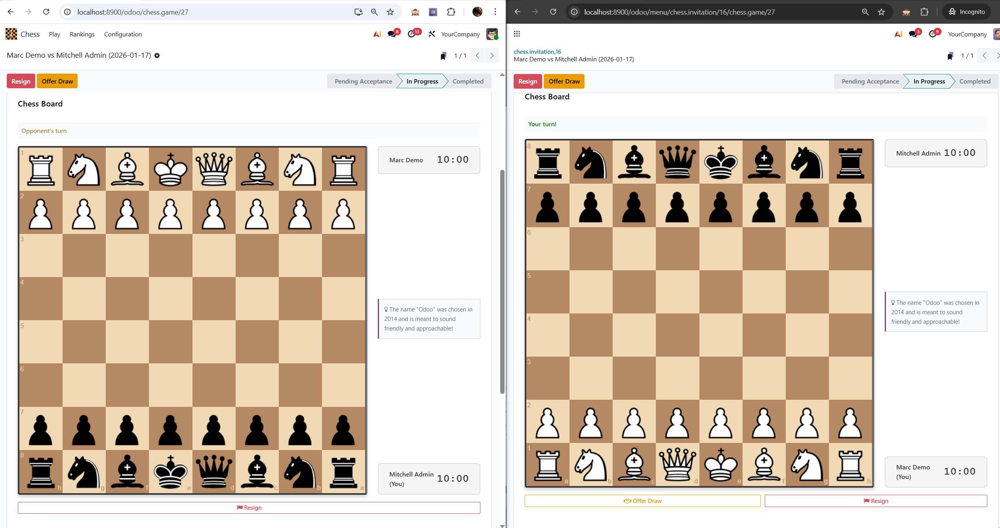

# Odoo Chess

A fully integrated multiplayer chess game module for Odoo 19. Challenge colleagues, play against computer bots, and compete on the leaderboard!





## Features

- **Real-Time Multiplayer** - Challenge any Odoo user with instant move synchronization via Odoo's longpolling bus
- **Bot Opponents** - Practice against 4 difficulty levels powered by the Sunfish chess engine:
  - Beginner Bob (800 Elo)
  - Casual Carl (1200 Elo)
  - Serious Sam (1500 Elo)
  - Randy Ram (1800 Elo)
- **Time Controls** - Bullet, Blitz, Rapid, Classical presets plus custom time with increment support
- **Elo Rating System** - Track skill with K-factor 32 ratings starting at 1200
- **Leaderboard** - Kanban view of top players with win/loss/draw statistics
- **Game Controls** - Resign, offer/accept/decline draws, claim draws by repetition or fifty-move rule, timeout claims
- **Invitation System** - Send challenges with optional stakes, real-time notifications, auto-created chat channels
- **Sound Effects** - Audio feedback for moves, captures, castling, check, and game results
- **Responsive Design** - Play on desktop or mobile with adaptive board sizing
- **Odoo Fun Facts** - Learn about Odoo while waiting for opponent's move

## Requirements

- Odoo 19.0
- Python `chess` library

## Installation

1. Clone this repository into your Odoo addons directory:
   ```bash
   git clone https://github.com/Codemarchant/odoo_chess.git
   ```

2. Install the Python chess library:
   ```bash
   pip install chess
   ```

3. Update your Odoo apps list and install "Odoo Chess" from the Apps menu.

## Security Groups

### Chess Player
- Play chess games against humans and bots
- View the leaderboard
- Send and receive game invitations
- Access only their own games and invitations

### Chess Manager
- All Chess Player permissions
- **Spectate any ongoing game** - Watch live games between other players
- Manage bot configurations
- Manage Odoo Fun Facts
- Delete games and invitations

## Technical Details

- Server-side move validation with the `chess` library
- OWL components with chessboard.js integration
- Mail thread integration for game comments
- FEN/PGN notation tracking for complete game history

## Dependencies

- `base`
- `web`
- `mail`
- `bus`

## License

This project is licensed under the LGPL-3.0 License - see the [LICENSE](LICENSE) file for details.

## Author

**Codemarchant**

- Website: [codemarchant.com](https://codemarchant.com)
- Support: support@codemarchant.com
